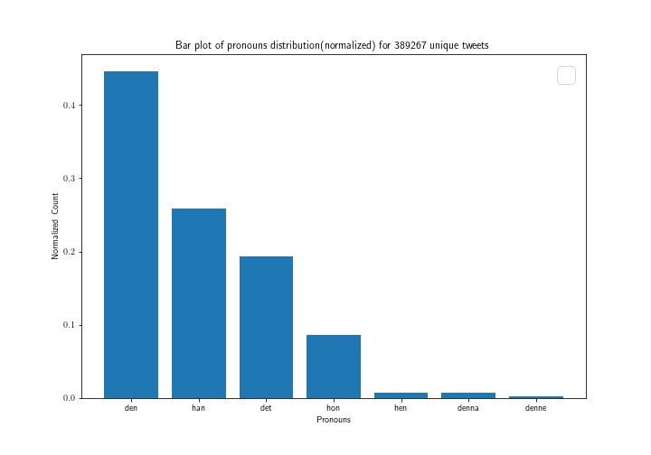

# ACC_Celery_RabbitMQ
## Compute-Service based on the distributed task queue Celery and RabbitMQ broker

### Install Rabbit MQ
```
$ sudo apt-get install rabbitmq-server 
```

### Install Celery using pip3
```
$ pip3 install celery
```
### Check that installations work

* Create script tasks.py

```
from celery import Celery

app = Celery('tasks', broker='pyamqp://guest@localhost//')

@app.task
def add(x, y):
    return x + y
```
#### Run the Celery Worker Server
```
$ celery -A tasks worker --loglevel=INFO
```
* Add a result backend
```
app = Celery('tasks', backend='rpc://', broker='pyamqp://guest@localhost//')
```
* Calling the task & getting results, run this on in python3 i.e., ```$python3``` 
 ```
 from tasks import add
 result = add.delay(4,4) 
 result.ready() #check if the task finished
 result.get(timeout=1) #get the result
```

### Download the data and scp to the instance

* https://uppsala.box.com/s/qiiggdjd98241wm7rl3lqehfhyjomg4
``` 
$ scp ~/data.tar.gz ubuntu@user:
$ tar -xzvf data.tar.gz -C /home/ubuntu/lab_3
```

### Set default python version to 3
``` 
 $ ls /usr/bin/python* 
 $ alias python='/usr/bin/python3.6' 
 $. ~/.bashrc 
 $ python --version
```
### Start the worker 
```
$celery -A pronoun_analysis worker --loglevel=INFO
```
### Flask 
```
 $ export FLASK_APP=flask_app.py
 $ flask run --host=0.0.0.0
```
### Results
```
$ curl -i http://<floating-ip>:<flask-port>/result_flask_app
```
make the curl request from any machine to get the results

```
"{\"den\": 173681, \"han\": 100508, \"det\": 75019, \"hon\": 33334, \"hen\": 3115, \"denna\": 2887, \"denne\": 723, \"Total\": 389267}"
```
### Normalized bar plot




### Contextualization 
* It is possible to contextualize this app using 'cloug-cfg.txt' by running `ssc_create_instance.py` this will provision a VM dedicated to the flask_app which we can curl from any machine.
* ATTENTION: The current caveat with this is that the data are not avaialble with `$wget` so you will have to work around that(e.g. scp) or provide your own data
